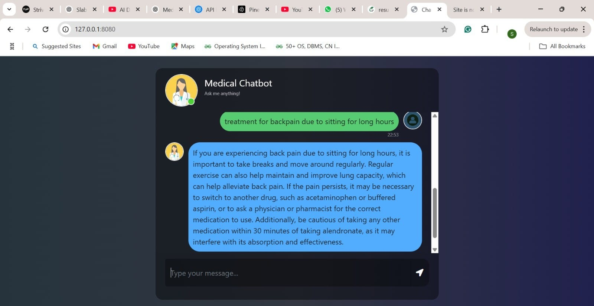

# 📉 CareAssist-Pro: Medical Chatbot using RAG and LLMs

**CareAssist-Pro** is an intelligent medical chatbot built using LangChain, Pinecone, and OpenAI. It enables users to query medical documents (PDFs) and receive accurate, real-time responses grounded in the uploaded content using **Retrieval-Augmented Generation (RAG)**.

---

## 🚀 Features

* 📁 **Medical Document Ingestion** – Upload and process medical PDFs into a queryable format.
* ✂️ **Text Chunking** – Efficient chunking using `RecursiveCharacterTextSplitter` for semantic integrity.
* 🔎 **Vector Search** – Semantic search using `Pinecone` vector database for fast and accurate retrieval.
* 🧠 **LLM-Powered Answers** – Uses OpenAI's LLM to generate reliable answers from contextually relevant document chunks.
* 🖼️ **Web Interface** – Clean, interactive frontend using Flask & HTML/CSS.
* 🛠️ **Modular Codebase** – Separated logic for helper functions, prompts, embedding, retrieval, and UI.
* 📦 **Production-ready Folder Structure** – Follows best practices with local package setup and `.env` environment management.

---

## 📁 Project Structure

```
CareAssist-Pro/
│
├── app.py                         # Main Flask App
├── requirements.txt              # Python Dependencies
├── .env                          # API Keys (OpenAI, Pinecone)
├── static/
│   └── style.css                 # Frontend Styling
├── templates/
│   └── chat.html                 # Web UI
├── src/
│   ├── helper.py                 # Embedding + Chunking Logic
│   └── prompt.py                 # RAG Prompt Configuration
└── store_index.py                # Embeds & stores chunks to Pinecone
```

---

## 🔧 Tech Stack

| Layer             | Technology                              |
| ----------------- | --------------------------------------- |
| LLM Inference     | OpenAI (ChatGPT via `langchain-openai`) |
| Vector Store      | Pinecone                                |
| Embeddings        | HuggingFace (`all-MiniLM-L6-v2`)        |
| Backend Framework | Flask                                   |
| Frontend          | HTML, CSS (Vanilla)                     |
| Chunking          | `RecursiveCharacterTextSplitter`        |
| RAG Engine        | LangChain’s Retrieval + Stuff Chain     |

---

## 🧠 How It Works

1. **Medical PDF Loading**: Documents are loaded from a directory using `PyPDFLoader`.
2. **Text Chunking**: Data is split into manageable chunks of \~500 characters with overlaps.
3. **Embedding**: Each chunk is embedded using `sentence-transformers/all-MiniLM-L6-v2`.
4. **Vector DB Storage**: Chunks are stored into a Pinecone index (`medicalbot`) with metadata.
5. **LLM Querying**: User input is retrieved, top-k matching chunks fetched, and passed to the LLM.
6. **Answer Generation**: OpenAI LLM generates a natural language response grounded in retrieved content.
7. **Response Rendering**: Output is displayed via the Flask frontend.

---

## 💡 Use Cases

* General medical queries based on uploaded documentation
* Context-aware chatbot for internal medical FAQs
* Support system for healthcare professionals

---

## 📸 Screenshots



---

## 🧪 Setup Instructions

```bash
git clone https://github.com/your-username/CareAssist-Pro.git
cd CareAssist-Pro
python -m venv venv
source venv/bin/activate  # or .\venv\Scripts\activate
pip install -r requirements.txt
```

Configure your `.env` file:

```env
OPENAI_API_KEY="sk-..."
PINECONE_API_KEY="xxxxxxxxxxxxxxxxxx"
```

Run embedding pipeline first (only once):

```bash
python store_index.py
```

Then run the chatbot app:

```bash
python app.py
```

Visit: `http://127.0.0.1:8080`

---


## 📘 Credits

* Built with 💙 using [LangChain](https://www.langchain.com/), [Pinecone](https://www.pinecone.io/), and [OpenAI](https://openai.com/)
* Inspired by real-world need for **searchable medical knowledge assistants**
